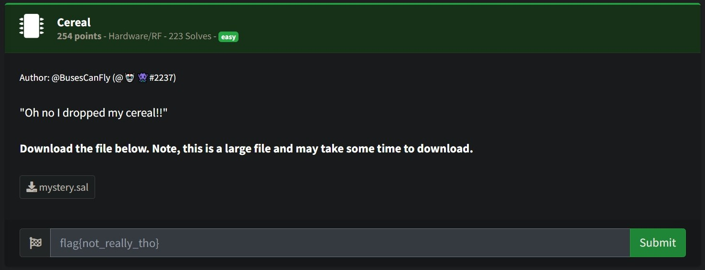
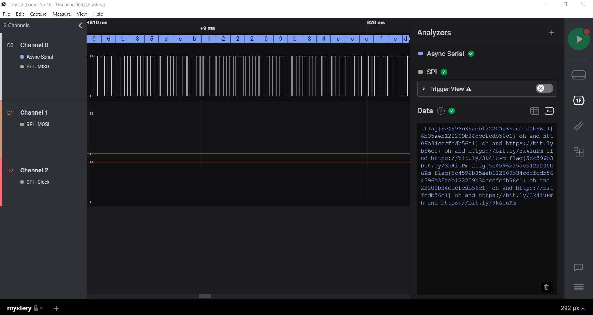

# Cereal



- __Attachments:__ [mystery.sal](resource/mystery.sal)

# Exploitation

Open __mystery.sal__ with [Logic Analyzer Software](https://www.saleae.com).

Click on __Analyzers__ > __Terminal__



The first line is the Flag.

# Flag

```
flag{5c4596b35aeb122209b34cccfcdb56c1}
```																																																																																					