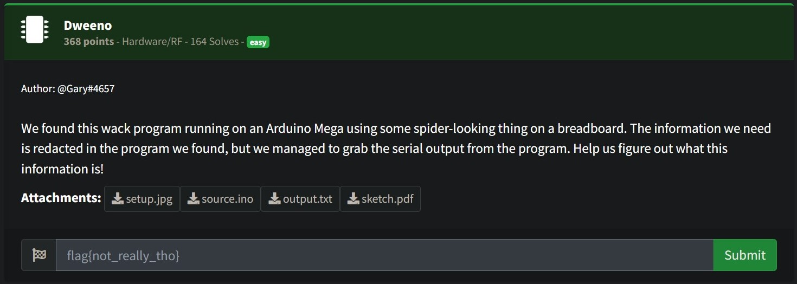
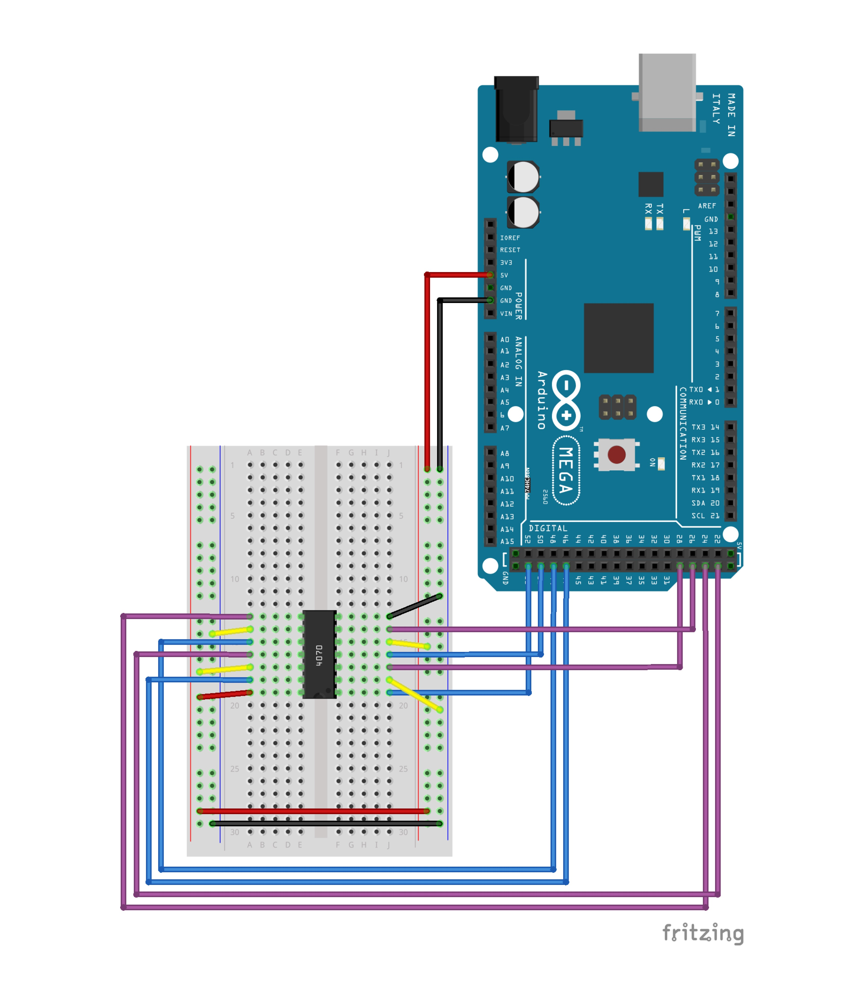
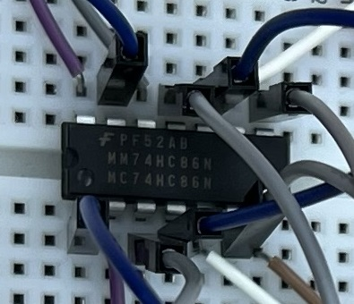
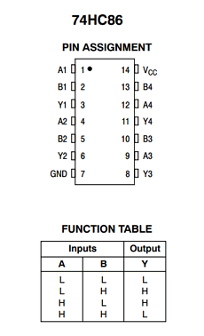
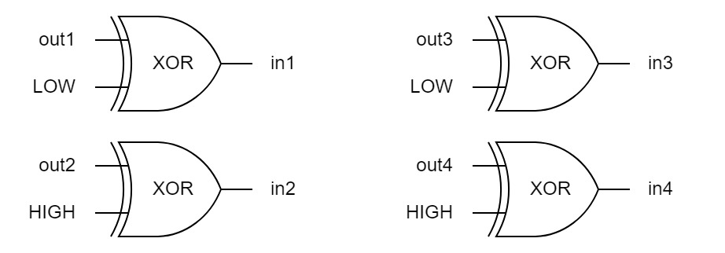

# Dweeno



- __Attachments:__ [setup.jpg](resource/setup.jpg), [source.ino](resource/source.ino), [output.txt](resource/output.txt), [sketch.pdf](resource/sketch.pdf)

# Resources
| File | Description |
|------|-------------|
| [setup.jpg](resource/setup.jpg) | A photo of real setup |
| [sketch.pdf](resource/sketch.pdf) | Contain a picture of circuit diagram |
| [source.ino](resource/source.ino) | Arduino source code file
| [output.txt](resource/output.txt) | Contain output from serial monitor of Arduino |

# Exploitation

Look at the [sketch.pdf](resource/sketch.pdf), I can see there is an Arduino Mega and an IC.



Now let's see [setup.jpg](resource/setup.jpg), I notice that IC is __74HC86__.



---

__74HC86__

is a quad 2-input EXCLUSIVE-OR gate.



---

Let's see the [source.ino](resource/source.ino).

```arduino
int in1=29, in2=27, in3=25, in4=23;
int out1=53, out2=51, out3=49, out4=47;
```

From here I can breakdown the circuit like below:



Continue look through the main program

```arduino
String get_output(String bits) {
    String output;
    digitalWrite(out1, ((bits[0] == '1')? HIGH : LOW));
    digitalWrite(out2, ((bits[1] == '1')? HIGH : LOW));
    digitalWrite(out3, ((bits[2] == '1')? HIGH : LOW));
    digitalWrite(out4, ((bits[3] == '1')? HIGH : LOW));
    delay(1000);
    output += String(digitalRead(in1));
    output += String(digitalRead(in2));
    output += String(digitalRead(in3));
    output += String(digitalRead(in4));
    return output;
}

void loop() {
  if (i < strlen(flag)) {
    curr = binary(flag[i]);
    first = curr.substring(0,4);
    second = curr.substring(4,8);
    Serial.print(get_output(first));
    Serial.println(get_output(second));
    delay(1000);
    i++;
  }
}
```


Process: String -> Binary -> ProcessInIC -> Output

```js
// process in IC looks like this
InputToIC ^ 01010101 = OutputFromIC
// to get back the InputToIC
OutputFromIC ^ 01010101 = InputToIC
```

So I wrote a small python program to convert back the output binary to string

[solution.py](solution.py)

```py
# python 3.10.4
f = open('./resource/output.txt', 'r')
result = ''
while True:
    binary = f.readline()
    if not binary:
        break
    result += chr(int(binary, 2) ^ int('01010101', 2))
print(result)
```

Output:
```console
flag{a16b8027cf374b115f7c3e2f622d84bc}
```


# Flag

```
flag{a16b8027cf374b115f7c3e2f622d84bc}
```																																																																																					