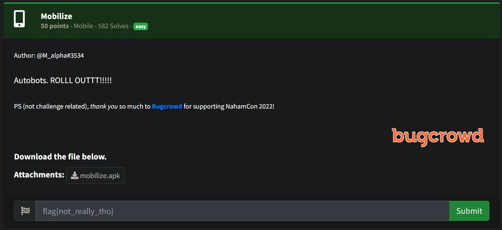
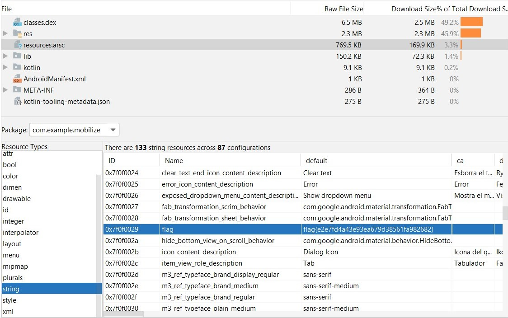

# Mobilize



- __Attachments:__ [mobilize.apk](resource/mobilize.apk)

# Exploitation

Debug __mobilize.apk__ with Android Studio.



# Flag

```
flag{e2e7fd4a43e93ea679d38561fa982682}
```																																																																																					